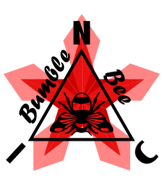

  

*[English](README.md) · [Čeština](README_cs.md) · [Русский](README_ru.md)*

★ N.I.C. ★

# NIC-FPLG

## Free-Piston Linear Generator — Open Concept

---

## What is FPLG?

NIC-FPLG is an open concept for a two-stroke two-cylinder linear engine with an
integrated tubular linear generator. No crankshaft. No camshaft. No valvetrain.
Two pistons share a single rod; a tubular generator sits at the rod's centre.
The engine runs permanently at one operating point in mechanical resonance;
power output is regulated by the battery, not the engine.

The project grew out of a simple observation: a crankshaft converts linear
motion to rotary motion just to convert it back to linear in the generator.
Every intermediate conversion has losses and complexity. FPLG cuts the middle out.

---

## Why not a conventional crankshaft engine?

- Operating point follows a full RPM map — every fuel, every load needs its own calibration
- Crankshaft, camshaft, valvetrain, timing chain — every moving part is a failure mode
- Resonance is impossible — frequency is locked to RPM, not to the physical system
- Thermal expansion mismatch between dissimilar materials requires tight tolerances everywhere

## Why not a rotary generator?

- Linear motion converted to rotary and back — two mechanical conversions, two sets of losses
- Crankshaft bearings carry the full combustion load at an angle
- Multi-fuel operation requires a full RPM × load map per fuel

## Why a free-piston linear design?

- One permanent operating point — three numbers per fuel instead of a full map
- Resonance frequency set by geometry: air spring (under-piston pre-compression ~1:2) plus rod mass form a resonator — tuned by design, not software
- Matched alloy piston and sleeve — identical thermal expansion, constant clearance at all temperatures
- Geometry does the work: drop-shaped pockets in the piston face direct flow and spin the charge without a camshaft; valve inertia delays transfer timing so the exhaust leaves first

---

## How it works

### One operating point

The engine never changes RPM. The battery absorbs all variable demand.
Switching fuels (petrol / LPG / diesel+petrol) means changing three numbers
— advance, mixture, oil dose — not remapping an entire table.

### Mechanical resonance

Under-piston pre-compression (~1:2) forms an air spring. Air spring plus rod
mass form a resonator. The operating frequency is set by the volume below the
pistons and the rod mass — tuned by design, not by software. Running in resonance
means the air spring returns reversal energy for free; the generator only takes
useful work.

### Charge transfer

No transfer ports in the cylinder wall. Transfer happens through valves in the
piston face — racing motorcycle exhaust valves (~16 mm), running in a cold role
(washed by fresh mixture from below). Drop-shaped pockets around each valve
direct the charge toward the spark plug and impart rotation to the piston on
every firing stroke. Valve inertia creates a natural phase delay — exhaust opens
first, transfer follows.

### Generator

Tubular flux-switching machine with hybrid excitation (~50 % permanent magnet /
~50 % field winding). Magnets and coils sit in the stator; the rod carries only
passive laminated teeth — minimum moving mass, magnets in the cooled zone.
Field can be reduced to near-zero for start-up and ramped up gradually to
regulate output.

---

## Documentation

| Document | Description |
|---|---|
| [DESIGN-FPLG.cs.md](DESIGN-FPLG.cs.md) | Full technical concept — 20 chapters (Czech) |
| [OPEN-QUESTIONS.cs.md](OPEN-QUESTIONS.cs.md) | What we don't know — simulation and test tasks |
| [SCHEMA-FPLG.svg](SCHEMA-FPLG.svg) | Schematic cross-section (placeholder) |
| `calc/` | (planned) numerical models — resonance, cycle |

---

## Status

Concept stage. Core architecture and design philosophy are defined.
Simulations, calculations, and a prototype are next.

Contributions welcome — simulation, dynamics, manufacturing, or anyone who
finds a hole in the reasoning. A specific objection is worth more than applause.

---

## License

MIT License — Copyright (c) 2026 NIC — Native Intellect Community

---

## Acknowledgements

Brother for advice during the development of this project.
For technical review during concept development, to AI assistant Claude (Anthropic).

★ Viva La Resistánce ★
