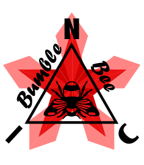

  

★ N.I.C. ★

# NIC-FPLG

*[English](README.md) · [Čeština](README_cs.md) · [Русский](README_ru.md)*

*Основной является английская версия.*

## Линейный генератор со свободным поршнем — открытая концепция

---

## Что такое FPLG?

NIC-FPLG — открытая концепция двухтактного двухцилиндрового линейного двигателя
со встроенным трубчатым линейным генератором. Без коленчатого вала. Без
распределительного вала. Без клапанного механизма.
Два поршня сидят на общем штоке; в центре штока находится трубчатый генератор.
Двигатель постоянно работает в одной рабочей точке в механическом резонансе;
выходная мощность регулируется аккумулятором, а не двигателем.

Проект вырос из простого наблюдения: коленчатый вал преобразует линейное
движение во вращательное лишь для того, чтобы в генераторе снова превратить его
в линейное. Каждое промежуточное преобразование — это потери и сложность. FPLG
убирает посредника.

---

## Почему не обычный двигатель с коленчатым валом?

- Рабочая точка проходит по полной карте оборотов — каждое топливо, каждая нагрузка требует собственной калибровки
- Коленчатый вал, распределительный вал, клапанный механизм, цепь привода ГРМ — каждая движущаяся деталь является источником отказа
- Резонанс невозможен — частота привязана к оборотам, а не к физической системе
- Различие теплового расширения у разнородных материалов требует жёстких допусков повсюду

## Почему не вращающийся генератор?

- Линейное движение преобразуется во вращательное и обратно — два механических преобразования, два набора потерь
- Подшипники коленчатого вала несут полную нагрузку от сгорания под углом
- Работа на нескольких видах топлива требует полной карты «обороты × нагрузка» для каждого топлива

## Почему линейная конструкция со свободным поршнем?

- Одна постоянная рабочая точка — три числа на топливо вместо полной карты
- Резонансная частота задаётся геометрией: воздушная пружина (предварительное сжатие под поршнем ~1:2) вместе с массой штока образуют резонатор — настройка конструкцией, а не программой
- Поршень и гильза из согласованного сплава — одинаковое тепловое расширение, постоянный зазор при любых температурах
- Работу выполняет геометрия: каплевидные карманы в днище поршня направляют поток и закручивают заряд без распределительного вала; инерция клапанов задерживает момент перепуска, так что выпуск начинается первым

---

## Как это работает

### Одна рабочая точка

Двигатель никогда не меняет обороты. Всю переменную потребность поглощает
аккумулятор. Смена топлива (бензин / LPG / дизель+бензин) означает изменение
трёх чисел — опережения, состава смеси, дозы масла, — а не перекалибровку
целой таблицы.

### Механический резонанс

Предварительное сжатие под поршнем (~1:2) образует воздушную пружину. Воздушная
пружина вместе с массой штока образуют резонатор. Рабочая частота задаётся
объёмом под поршнями и массой штока — настройка конструкцией, а не программой.
Работа в резонансе означает, что воздушная пружина даром возвращает энергию
реверса; генератор забирает только полезную работу.

### Перепуск заряда

В стенке цилиндра нет перепускных окон. Перепуск происходит через клапаны в
днище поршня — выпускные клапаны от гоночных мотоциклов (~16 mm), работающие в
холодной роли (омываются снизу свежей смесью). Каплевидные карманы вокруг
каждого клапана направляют заряд к свече зажигания и сообщают поршню вращение
на каждом рабочем ходе. Инерция клапанов создаёт естественную фазовую задержку —
сначала открывается выпуск, затем следует перепуск.

### Генератор

Трубчатая машина с переключением потока и гибридным возбуждением (~50 %
постоянные магниты / ~50 % обмотка возбуждения). Магниты и катушки находятся в
статоре; шток несёт только пассивные шихтованные зубцы — минимальная движущаяся
масса, магниты в охлаждаемой зоне. Возбуждение можно снизить почти до нуля для
пуска и затем постепенно наращивать для регулирования выходной мощности.

---

## Документация

| Документ | Описание |
|---|---|
| [DESIGN-FPLG.md](DESIGN-FPLG_ru.md) | Полная техническая концепция — 20 глав |
| [OPEN-QUESTIONS.md](OPEN-QUESTIONS_ru.md) | Чего мы не знаем — задачи для моделирования и испытаний |
| [calc/](calc/README_ru.md) | 0D-модели — динамика, резонанс, термодинамический цикл, управление — и что говорят их числа |
| [CHANGELOG.md](CHANGELOG_ru.md) | Что изменилось от выпуска к выпуску |

---

## Статус

**v0.5** — стадия концепции. Базовая архитектура и философия конструкции
определены, а ключевые числа теперь подкреплены 0D-моделью динамики +
термодинамики (см. [`calc/`](calc/)). Следующие шаги — 1D-модель газообмена /
продувки, CFD и прототип.

Мы рады вкладу — моделирование, динамика, производство или любой, кто найдёт
дыру в рассуждениях. Конкретное возражение ценнее аплодисментов.

---

## Лицензия

MIT License — Copyright (c) 2026 NIC — Native Intellect Community

---

## Благодарности

Брату — за советы в ходе разработки этого проекта.
За техническое рецензирование при разработке концепции — ИИ-ассистенту Claude (Anthropic).

★ Viva La Resistánce ★
